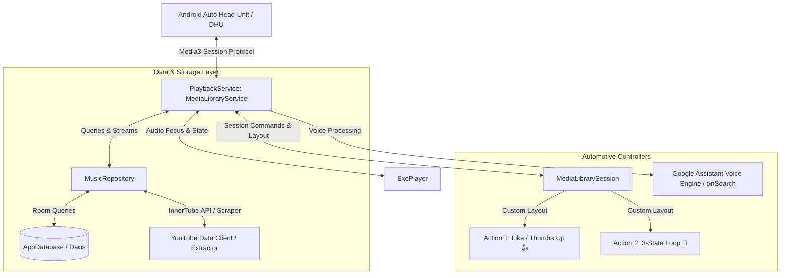
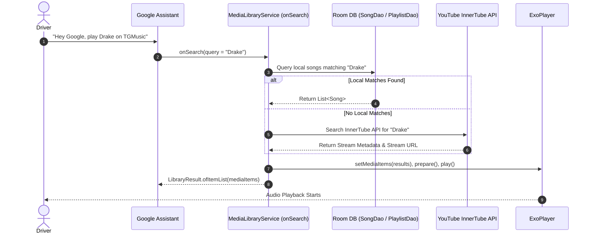

# Android Auto UI & Automotive Features Technical Specification

> **Project**: TGMusic AI  
> **Document Type**: Architecture & Implementation Specification  
> **Target Subsystem**: Android Auto / Jetpack Media3 Automotive Media Library Service  
> **Target Service Class**: `com.example.tgmusicai.playback.PlaybackService`  

---

## Executive Summary

This document serves as the authoritative blueprint for implementing, refining, and validating the **Android Auto UI and Automotive Experience** in TGMusic. TGMusic connects to car head units via Android Auto using **Jetpack Media3 (`androidx.media3.session.MediaLibraryService`)**.

This specification outlines the complete 6-part automotive architecture required to deliver a safe, responsive, and rich media experience on vehicle displays.

---

## Architecture Diagram: Android Auto Component Topology



---

## Part 1: Automotive Media Tree Architecture (`onGetLibraryRoot` & `onGetChildren`)

Android Auto head units display browseable media categories generated dynamically via `MediaLibraryService.Callback.onGetLibraryRoot` and `onGetChildren`.

### 1.1 Root Media Categories (`onGetLibraryRoot`)

When an Android Auto head unit connects, `onGetLibraryRoot` validates the client connection and returns the root `MediaItem` (`id = "root"`). Subsequent requests to `onGetChildren(parentId = "root")` expose the following top-level categories:

| Category ID | Display Title | Visual Style | Sub-tree Description | Target Driving Use-case |
| :--- | :--- | :--- | :--- | :--- |
| `category_downloaded` | **Downloaded Only** | List | Local `.m4a` / `.mp3` tracks saved in offline storage. | Critical for driving through rural dead zones & offline trips. |
| `category_liked` | **Liked Music** | Grid | Favorites list (thumbs-up tracks) with custom heart/like badge art. | Quick 1-tap access to primary favorite tracks. |
| `category_recent` | **Listen Again (Recently Played)** | Grid | Chronological stream of recently played tracks from `ListeningHistoryDao`. | Dashboard re-engagement with recently started albums/tracks. |
| `category_playlists` | **Playlists** | Grid | Custom playlists showcasing top-song thumbnail collages. | Selective album/playlist browsing while parked or stopped. |
| `category_most_played` | **Top 50 Most Played** | List | Dynamic smart list generated from `SongStatsDao` play counts. | Automatic high-frequency rotation access. |
| `category_producers` | **Producers & Artists** | Grid | Hierarchical sub-tree grouped by Producer / Artist metadata tags. | Extended metadata browsing by creator/producer. |
| `category_all_songs` | **All Songs** | List | Alphabetical master catalog of all database tracks. | Standard complete catalog search and playback. |

---

### 1.2 Hierarchy & Sub-Tree Navigation Paths

```
ROOT ("root")
├── 📁 "Downloaded Only" ("category_downloaded") [BROWSABLE]
│   └── 🎵 Track 1 ("song_101") [PLAYABLE]
│   └── 🎵 Track 2 ("song_102") [PLAYABLE]
├── 📁 "Liked Music" ("category_liked") [BROWSABLE]
│   └── 🎵 Track A ("song_201") [PLAYABLE]
├── 📁 "Listen Again (Recently Played)" ("category_recent") [BROWSABLE]
│   └── 🎵 Track B ("song_301") [PLAYABLE]
├── 📁 "Playlists" ("category_playlists") [BROWSABLE]
│   ├── 📁 Playlist 1 ("playlist_10") [BROWSABLE]
│   │   └── 🎵 Track P1 ("song_501") [PLAYABLE]
│   └── 📁 Playlist 2 ("playlist_11") [BROWSABLE]
├── 📁 "Top 50 Most Played" ("category_most_played") [BROWSABLE]
│   └── 🎵 Track M1 ("song_601") [PLAYABLE]
├── 📁 "Producers & Artists" ("category_producers") [BROWSABLE]
│   ├── 📁 Artist "Drake" ("artist_Drake") [BROWSABLE]
│   │   └── 🎵 Track D1 ("song_701") [PLAYABLE]
│   └── 📁 Producer "Metro Boomin" ("producer_Metro Boomin") [BROWSABLE]
│       └── 🎵 Track MB1 ("song_702") [PLAYABLE]
└── 📁 "All Songs" ("category_all_songs") [BROWSABLE]
    └── 🎵 Track 1..N [PLAYABLE]
```

### 1.3 MediaItem Flag Specifications

- **Browsable Category Nodes**: Must set `MediaMetadata.isBrowsable = true`, `MediaMetadata.isPlayable = false`, and `MediaMetadata.MediaType = MEDIA_TYPE_FOLDER_MIXED`.
- **Playable Songs Nodes**: Must set `MediaMetadata.isBrowsable = false`, `MediaMetadata.isPlayable = true`, `MediaMetadata.MediaType = MEDIA_TYPE_MUSIC`, and include a valid `mediaUri` pointing to local storage or resolved stream URL.

---

## Part 2: Custom Car Screen Playback Actions (`MediaSession.setCustomLayout`)

Android Auto player screens support custom action buttons placed alongside primary media controls (Play/Pause, Skip Next, Skip Previous). TGMusic provides two custom interactive controls.

### 2.1 Custom Action 1: Thumbs Up (Like) Toggle (`👍`)

- **Action ID**: `com.example.tgmusicai.ACTION_TOGGLE_LIKE`
- **Icon Resource**:
  - Liked State: `R.drawable.ic_thumb_up_filled` (or `ic_heart_filled`)
  - Unliked State: `R.drawable.ic_thumb_up_outline` (or `ic_heart_outline`)
- **Behavior**:
  1. Driver presses `👍` on car head unit screen.
  2. `onCustomCommand` receives `ACTION_TOGGLE_LIKE`.
  3. Service inspects current `MediaItem`, toggles `isLiked` state in `SongDao` / `MusicRepository`.
  4. Service updates internal `MediaMetadata` for the active item.
  5. Service calls `updateCustomLayout()` to immediately update the button icon on car display.

### 2.2 Custom Action 2: 3-State Loop Cycle (`🔁`)

- **Action ID**: `com.example.tgmusicai.ACTION_TOGGLE_REPEAT_MODE`
- **State Transition Cycle**:
  $$\text{REPEAT\_MODE\_OFF (Off)} \longrightarrow \text{REPEAT\_MODE\_ALL (Loop Playlist)} \longrightarrow \text{REPEAT\_MODE\_ONE (Loop Song '1')} \longrightarrow \text{REPEAT\_MODE\_OFF}$$
- **State Details & Visual Identifiers**:

| Mode State | ExoPlayer Mode | Icon Display | Badge/Label Text |
| :--- | :--- | :--- | :--- |
| **Off** | `Player.REPEAT_MODE_OFF` | `ic_repeat_off` | "Repeat: Off" |
| **Loop Playlist** | `Player.REPEAT_MODE_ALL` | `ic_repeat_all` | "Repeat: All" |
| **Loop Song** | `Player.REPEAT_MODE_ONE` | `ic_repeat_one` | "Repeat: 1" |

- **Behavior**:
  1. Driver presses `🔁` on car screen player.
  2. `onCustomCommand` intercepts command and computes next mode: `(currentMode + 1) % 3`.
  3. Player repeat mode updated: `player.repeatMode = newMode`.
  4. `updateCustomLayout()` refreshes layout buttons sent to `mediaLibrarySession.setCustomLayout()`.

---

## Part 3: Google Assistant Voice Commands (`onSearch`)

Drivers must be able to initiate hands-free playback using Google Assistant.

### 3.1 Voice Query Processing Matrix

The service implements `MediaLibraryService.Callback.onSearch(session, controller, query, extras)` to process voice commands:

| Voice Command Example | Raw Query Received | Matching Strategy | Resolution & Action |
| :--- | :--- | :--- | :--- |
| *"Hey Google, play Drake on TGMusic"* | `"Drake"` | Search Room `SongDao` by artist name (`artist LIKE %Drake%`). Fallback to YouTube InnerTube search API if no local hits. | Constructs list of matching songs, populates ExoPlayer queue, and starts playback (`play()`). |
| *"Hey Google, play my Liked Music on TGMusic"* | `"Liked Music"` / `"liked"` | Regex match against `"liked"` or `"favorites"`. Queries `SongDao.getLikedSongs()`. | Loads Liked Music queue and begins playing top track immediately. |
| *"Hey Google, play Starboy"* | `"Starboy"` | Exact/Fuzzy match on `song.title`. | Builds search results, plays exact track match. |
| *"Hey Google, play driving playlist"* | `"driving playlist"` | Search `PlaylistDao` by title matching `"driving"`. | Loads matching playlist queue and starts playback. |

### 3.2 Asynchronous Search Resolution Flow



---

## Part 4: Car Head Unit Content Styles & Grid/List Rendering

Android Auto respects presentation hints specified via `MediaMetadata` extras to select between **Grid Layouts** (rich album cover tiles) and **List Layouts** (dense text rows).

### 4.1 Content Style Extra Keys & Values

Jetpack Media3 uses bundle extras to transmit presentation preferences to Android Auto head units:

```kotlin
// Media3 / Legacy Content Style Keys
const val EXTRAS_KEY_CONTENT_STYLE_BROWSABLE = "android.media.browse.CONTENT_STYLE_BROWSABLE"
const val EXTRAS_KEY_CONTENT_STYLE_PLAYABLE = "android.media.browse.CONTENT_STYLE_PLAYABLE"

// Style Values
const val EXTRAS_VALUE_CONTENT_STYLE_GRID = 1
const val EXTRAS_VALUE_CONTENT_STYLE_LIST = 2
```

### 4.2 Presentation Style Assignments

> [!IMPORTANT]
> - **GRID Layout (`EXTRAS_VALUE_CONTENT_STYLE_GRID = 1`)**: Applied to browsable categories with distinct album artwork (Playlists, Liked Music, Listen Again, Producers/Artists).
> - **LIST Layout (`EXTRAS_VALUE_CONTENT_STYLE_LIST = 2`)**: Applied to track lists for high readability and fast scannability while driving (All Songs, Downloaded Only, Top 50 Most Played, Playlist Track Contents).

```kotlin
fun applyContentStyle(
    builder: MediaMetadata.Builder,
    browsableStyle: Int = EXTRAS_VALUE_CONTENT_STYLE_GRID,
    playableStyle: Int = EXTRAS_VALUE_CONTENT_STYLE_LIST
): MediaMetadata.Builder {
    val extras = Bundle().apply {
        putInt(EXTRAS_KEY_CONTENT_STYLE_BROWSABLE, browsableStyle)
        putInt(EXTRAS_KEY_CONTENT_STYLE_PLAYABLE, playableStyle)
    }
    return builder.setExtras(extras)
}
```

---

## Part 5: Safe Driving Audio Focus & Navigation Ducking

Driving safety requires automatic audio focus compliance to ensure navigation prompts (Google Maps, Waze) and phone calls take precedence over music playback.

### 5.1 ExoPlayer Audio Attributes Configuration

ExoPlayer is configured during service initialization with automatic focus handling:

```kotlin
val audioAttributes = AudioAttributes.Builder()
    .setContentType(C.AUDIO_CONTENT_TYPE_MUSIC)
    .setUsage(C.USAGE_MEDIA)
    .build()

player = ExoPlayer.Builder(context)
    .setAudioAttributes(audioAttributes, true /* handleAudioFocus = true */)
    .setHandleAudioBecomingNoisy(true) // Pauses playback when headphones or Bluetooth disconnect
    .build()
```

### 5.2 Audio Focus Behavior Matrix

| Driving Event | Focus Change Trigger | ExoPlayer Action | Volume State Transition |
| :--- | :--- | :--- | :--- |
| **GPS Voice Prompt** (e.g., Google Maps "Turn Left") | `AUDIOFOCUS_LOSS_TRANSIENT_CAN_DUCK` | Volume lowered automatically (Ducking). Playback continues. | $1.0f \longrightarrow 0.2f \longrightarrow 1.0f$ |
| **Incoming Phone Call** | `AUDIOFOCUS_LOSS_TRANSIENT` | Playback paused automatically. | $1.0f \longrightarrow \text{Paused}$ |
| **Phone Call Ends** | `AUDIOFOCUS_GAIN` | Playback automatically resumes from pause position. | $\text{Paused} \longrightarrow 1.0f$ (Playing) |
| **Other Media App Starts** | `AUDIOFOCUS_LOSS` | Playback permanently stopped. Service releases transient resources. | Stopped |
| **Bluetooth/Aux Disconnect** | `ACTION_AUDIO_BECOMING_NOISY` | Playback automatically paused to prevent loud speaker playback. | Paused |

---

## Part 6: Complete Jetpack Media3 Code Blueprint (`PlaybackService.kt`)

> [!NOTE]
> The following complete production blueprint details the required code implementation for `com.example.tgmusicai.playback.PlaybackService`.

```kotlin
package com.example.tgmusicai.playback

import android.content.Intent
import android.net.Uri
import android.os.Bundle
import androidx.media3.common.AudioAttributes
import androidx.media3.common.C
import androidx.media3.common.MediaItem
import androidx.media3.common.MediaMetadata
import androidx.media3.common.Player
import androidx.media3.exoplayer.ExoPlayer
import androidx.media3.session.CommandButton
import androidx.media3.session.LibraryResult
import androidx.media3.session.MediaLibraryService
import androidx.media3.session.MediaSession
import androidx.media3.session.SessionCommand
import androidx.media3.session.SessionResult
import com.example.tgmusicai.R
import com.example.tgmusicai.data.local.AppDatabase
import com.example.tgmusicai.data.local.entity.Song
import com.google.common.collect.ImmutableList
import com.google.common.util.concurrent.Futures
import com.google.common.util.concurrent.ListenableFuture
import kotlinx.coroutines.CoroutineScope
import kotlinx.coroutines.Dispatchers
import kotlinx.coroutines.SupervisorJob
import kotlinx.coroutines.cancel
import kotlinx.coroutines.guava.future
import kotlinx.coroutines.launch
import kotlinx.coroutines.withContext

/**
 * Automotive-optimized MediaLibraryService for TGMusic AI.
 * Provides Android Auto media browsing, custom screen controls, voice search, and focus handling.
 */
class PlaybackService : MediaLibraryService() {

    private var mediaLibrarySession: MediaLibrarySession? = null
    private lateinit var player: ExoPlayer
    private lateinit var database: AppDatabase
    private val serviceScope = CoroutineScope(SupervisorJob() + Dispatchers.IO)

    companion object {
        // Automotive Category IDs
        const val ROOT_ID = "root"
        const val CATEGORY_DOWNLOADED = "category_downloaded"
        const val CATEGORY_LIKED = "category_liked"
        const val CATEGORY_RECENT = "category_recent"
        const val CATEGORY_PLAYLISTS = "category_playlists"
        const val CATEGORY_MOST_PLAYED = "category_most_played"
        const val CATEGORY_PRODUCERS = "category_producers"
        const val CATEGORY_ALL_SONGS = "category_all_songs"

        // Custom Actions for Car Display Controls
        const val ACTION_TOGGLE_LIKE = "com.example.tgmusicai.ACTION_TOGGLE_LIKE"
        const val ACTION_TOGGLE_REPEAT_MODE = "com.example.tgmusicai.ACTION_TOGGLE_REPEAT_MODE"

        // Content Style Extra Keys
        const val EXTRAS_KEY_CONTENT_STYLE_BROWSABLE = "android.media.browse.CONTENT_STYLE_BROWSABLE"
        const val EXTRAS_KEY_CONTENT_STYLE_PLAYABLE = "android.media.browse.CONTENT_STYLE_PLAYABLE"
        const val EXTRAS_VALUE_CONTENT_STYLE_GRID = 1
        const val EXTRAS_VALUE_CONTENT_STYLE_LIST = 2
    }

    override fun onCreate() {
        super.onCreate()
        database = AppDatabase.getDatabase(this)

        // 1. Initialize ExoPlayer with Safe Driving Audio Focus
        val audioAttributes = AudioAttributes.Builder()
            .setContentType(C.AUDIO_CONTENT_TYPE_MUSIC)
            .setUsage(C.USAGE_MEDIA)
            .build()

        player = ExoPlayer.Builder(this)
            .setAudioAttributes(audioAttributes, true /* Automatic Focus & Ducking */)
            .setHandleAudioBecomingNoisy(true)
            .build().apply {
                repeatMode = Player.REPEAT_MODE_OFF
                addListener(object : Player.Listener {
                    override fun onMediaItemTransition(mediaItem: MediaItem?, reason: Int) {
                        updateCustomLayout()
                    }

                    override fun onRepeatModeChanged(repeatMode: Int) {
                        updateCustomLayout()
                    }
                })
            }

        // 2. Build MediaLibrarySession with Custom Callback
        mediaLibrarySession = MediaLibrarySession.Builder(this, player, CustomLibraryCallback())
            .setId("TGMusicMediaSession")
            .build()

        updateCustomLayout()
    }

    override fun onGetSession(controllerInfo: MediaSession.ControllerInfo): MediaLibrarySession? {
        return mediaLibrarySession
    }

    override fun onDestroy() {
        mediaLibrarySession?.run {
            player.release()
            release()
            mediaLibrarySession = null
        }
        serviceScope.cancel()
        super.onDestroy()
    }

    /**
     * Updates the custom layout action buttons rendered on the car head unit display.
     */
    private fun updateCustomLayout() {
        val session = mediaLibrarySession ?: return
        val currentMediaItem = player.currentMediaItem
        val mediaId = currentMediaItem?.mediaId

        serviceScope.launch {
            // Check if current track is liked in Room DB
            val isLiked = if (mediaId != null) {
                withContext(Dispatchers.IO) {
                    database.songDao().getSongById(mediaId)?.isLiked == true
                }
            } else false

            // Build Like Action Button
            val likeIconRes = if (isLiked) {
                R.drawable.ic_thumb_up_filled
            } else {
                R.drawable.ic_thumb_up_outline
            }
            val likeButton = CommandButton.Builder()
                .setDisplayName(if (isLiked) "Unlike" else "Like")
                .setIconResId(likeIconRes)
                .setSessionCommand(SessionCommand(ACTION_TOGGLE_LIKE, Bundle.EMPTY))
                .build()

            // Build Repeat Mode Action Button
            val (repeatIconRes, repeatTitle) = when (player.repeatMode) {
                Player.REPEAT_MODE_ALL -> Pair(R.drawable.ic_repeat_all, "Repeat: All")
                Player.REPEAT_MODE_ONE -> Pair(R.drawable.ic_repeat_one, "Repeat: 1")
                else -> Pair(R.drawable.ic_repeat_off, "Repeat: Off")
            }
            val repeatButton = CommandButton.Builder()
                .setDisplayName(repeatTitle)
                .setIconResId(repeatIconRes)
                .setSessionCommand(SessionCommand(ACTION_TOGGLE_REPEAT_MODE, Bundle.EMPTY))
                .build()

            val customLayout = ImmutableList.of(likeButton, repeatButton)
            session.setCustomLayout(customLayout)
        }
    }

    /**
     * MediaLibrarySessionCallback handling navigation, search, and custom car commands.
     */
    private inner class CustomLibraryCallback : MediaLibrarySession.Callback {

        override fun onGetLibraryRoot(
            session: MediaLibrarySession,
            controller: MediaSession.ControllerInfo,
            params: LibraryParams?
        ): ListenableFuture<LibraryResult<MediaItem>> {
            val rootExtras = Bundle().apply {
                putInt(EXTRAS_KEY_CONTENT_STYLE_BROWSABLE, EXTRAS_VALUE_CONTENT_STYLE_GRID)
                putInt(EXTRAS_KEY_CONTENT_STYLE_PLAYABLE, EXTRAS_VALUE_CONTENT_STYLE_LIST)
            }
            val rootItem = MediaItem.Builder()
                .setMediaId(ROOT_ID)
                .setMediaMetadata(
                    MediaMetadata.Builder()
                        .setTitle("TGMusic Library")
                        .setIsBrowsable(true)
                        .setIsPlayable(false)
                        .setMediaType(MediaMetadata.MEDIA_TYPE_FOLDER_MIXED)
                        .setExtras(rootExtras)
                        .build()
                )
                .build()

            return Futures.immediateFuture(LibraryResult.ofItem(rootItem, params))
        }

        override fun onGetChildren(
            session: MediaLibrarySession,
            controller: MediaSession.ControllerInfo,
            parentId: String,
            page: Int,
            pageSize: Int,
            params: LibraryParams?
        ): ListenableFuture<LibraryResult<ImmutableList<MediaItem>>> {
            return serviceScope.future {
                val items = when (parentId) {
                    ROOT_ID -> buildRootCategories()
                    CATEGORY_DOWNLOADED -> fetchDownloadedSongs()
                    CATEGORY_LIKED -> fetchLikedSongs()
                    CATEGORY_RECENT -> fetchRecentlyPlayedSongs()
                    CATEGORY_PLAYLISTS -> fetchPlaylists()
                    CATEGORY_MOST_PLAYED -> fetchTopPlayedSongs()
                    CATEGORY_PRODUCERS -> fetchProducersAndArtists()
                    CATEGORY_ALL_SONGS -> fetchAllSongs()
                    else -> {
                        if (parentId.startsWith("playlist_")) {
                            fetchSongsForPlaylist(parentId.removePrefix("playlist_"))
                        } else if (parentId.startsWith("artist_")) {
                            fetchSongsForArtist(parentId.removePrefix("artist_"))
                        } else {
                            emptyList()
                        }
                    }
                }
                LibraryResult.ofItemList(ImmutableList.copyOf(items), params)
            }
        }

        override fun onSearch(
            session: MediaLibrarySession,
            controller: MediaSession.ControllerInfo,
            query: String,
            params: LibraryParams?
        ): ListenableFuture<LibraryResult<ImmutableList<MediaItem>>> {
            return serviceScope.future {
                val searchResults = searchSongsAndPlaylists(query)
                if (searchResults.isNotEmpty()) {
                    withContext(Dispatchers.Main) {
                        player.setMediaItems(searchResults)
                        player.prepare()
                        player.play()
                    }
                }
                LibraryResult.ofItemList(ImmutableList.copyOf(searchResults), params)
            }
        }

        override fun onCustomCommand(
            session: MediaSession,
            controller: MediaSession.ControllerInfo,
            customCommand: SessionCommand,
            args: Bundle
        ): ListenableFuture<SessionResult> {
            when (customCommand.customAction) {
                ACTION_TOGGLE_LIKE -> {
                    val currentItem = player.currentMediaItem
                    val mediaId = currentItem?.mediaId
                    if (mediaId != null) {
                        serviceScope.launch {
                            val song = database.songDao().getSongById(mediaId)
                            if (song != null) {
                                val updated = song.copy(isLiked = !song.isLiked)
                                database.songDao().insertSong(updated)
                                updateCustomLayout()
                            }
                        }
                    }
                    return Futures.immediateFuture(SessionResult(SessionResult.RESULT_SUCCESS))
                }

                ACTION_TOGGLE_REPEAT_MODE -> {
                    val nextMode = when (player.repeatMode) {
                        Player.REPEAT_MODE_OFF -> Player.REPEAT_MODE_ALL
                        Player.REPEAT_MODE_ALL -> Player.REPEAT_MODE_ONE
                        else -> Player.REPEAT_MODE_OFF
                    }
                    player.repeatMode = nextMode
                    updateCustomLayout()
                    return Futures.immediateFuture(SessionResult(SessionResult.RESULT_SUCCESS))
                }
            }
            return Futures.immediateFuture(SessionResult(SessionResult.RESULT_ERROR_NOT_SUPPORTED))
        }

        // --- Helper Methods for Category Generation ---

        private fun buildRootCategories(): List<MediaItem> {
            val categoryList = listOf(
                Triple(CATEGORY_DOWNLOADED, "Downloaded Only", EXTRAS_VALUE_CONTENT_STYLE_LIST),
                Triple(CATEGORY_LIKED, "Liked Music", EXTRAS_VALUE_CONTENT_STYLE_GRID),
                Triple(CATEGORY_RECENT, "Listen Again (Recently Played)", EXTRAS_VALUE_CONTENT_STYLE_GRID),
                Triple(CATEGORY_PLAYLISTS, "Playlists", EXTRAS_VALUE_CONTENT_STYLE_GRID),
                Triple(CATEGORY_MOST_PLAYED, "Top 50 Most Played", EXTRAS_VALUE_CONTENT_STYLE_LIST),
                Triple(CATEGORY_PRODUCERS, "Producers & Artists", EXTRAS_VALUE_CONTENT_STYLE_GRID),
                Triple(CATEGORY_ALL_SONGS, "All Songs", EXTRAS_VALUE_CONTENT_STYLE_LIST)
            )

            return categoryList.map { (id, title, style) ->
                val extras = Bundle().apply {
                    putInt(EXTRAS_KEY_CONTENT_STYLE_BROWSABLE, style)
                }
                MediaItem.Builder()
                    .setMediaId(id)
                    .setMediaMetadata(
                        MediaMetadata.Builder()
                            .setTitle(title)
                            .setIsBrowsable(true)
                            .setIsPlayable(false)
                            .setMediaType(MediaMetadata.MEDIA_TYPE_FOLDER_MIXED)
                            .setExtras(extras)
                            .build()
                    )
                    .build()
            }
        }

        private suspend fun fetchDownloadedSongs(): List<MediaItem> = withContext(Dispatchers.IO) {
            database.songDao().getAllSongsSync()
                .filter { !it.localFilePath.isNullOrEmpty() }
                .map { it.toMediaItem() }
        }

        private suspend fun fetchLikedSongs(): List<MediaItem> = withContext(Dispatchers.IO) {
            database.songDao().getLikedSongsSync().map { it.toMediaItem() }
        }

        private suspend fun fetchRecentlyPlayedSongs(): List<MediaItem> = withContext(Dispatchers.IO) {
            database.listeningHistoryDao().getRecentlyPlayedSync(limit = 20).map { it.toMediaItem() }
        }

        private suspend fun fetchPlaylists(): List<MediaItem> = withContext(Dispatchers.IO) {
            database.playlistDao().getAllPlaylistsSync().map { playlist ->
                val extras = Bundle().apply {
                    putInt(EXTRAS_KEY_CONTENT_STYLE_PLAYABLE, EXTRAS_VALUE_CONTENT_STYLE_LIST)
                }
                MediaItem.Builder()
                    .setMediaId("playlist_${playlist.id}")
                    .setMediaMetadata(
                        MediaMetadata.Builder()
                            .setTitle(playlist.title)
                            .setSubtitle("${playlist.songCount} Songs")
                            .setIsBrowsable(true)
                            .setIsPlayable(false)
                            .setMediaType(MediaMetadata.MEDIA_TYPE_PLAYLIST)
                            .setExtras(extras)
                            .build()
                    )
                    .build()
            }
        }

        private suspend fun fetchTopPlayedSongs(): List<MediaItem> = withContext(Dispatchers.IO) {
            database.songStatsDao().getTopPlayedSongsSync(limit = 50).map { it.toMediaItem() }
        }

        private suspend fun fetchProducersAndArtists(): List<MediaItem> = withContext(Dispatchers.IO) {
            val artists = database.songDao().getUniqueArtistsSync()
            artists.map { artist ->
                MediaItem.Builder()
                    .setMediaId("artist_$artist")
                    .setMediaMetadata(
                        MediaMetadata.Builder()
                            .setTitle(artist)
                            .setIsBrowsable(true)
                            .setIsPlayable(false)
                            .setMediaType(MediaMetadata.MEDIA_TYPE_ARTIST)
                            .build()
                    )
                    .build()
            }
        }

        private suspend fun fetchAllSongs(): List<MediaItem> = withContext(Dispatchers.IO) {
            database.songDao().getAllSongsSync().map { it.toMediaItem() }
        }

        private suspend fun fetchSongsForPlaylist(playlistId: String): List<MediaItem> = withContext(Dispatchers.IO) {
            database.playlistDao().getSongsForPlaylistSync(playlistId.toLongOrNull() ?: 0L).map { it.toMediaItem() }
        }

        private suspend fun fetchSongsForArtist(artist: String): List<MediaItem> = withContext(Dispatchers.IO) {
            database.songDao().getSongsByArtistSync(artist).map { it.toMediaItem() }
        }

        private suspend fun searchSongsAndPlaylists(query: String): List<MediaItem> = withContext(Dispatchers.IO) {
            if (query.equals("liked", ignoreCase = true) || query.equals("liked music", ignoreCase = true)) {
                return@withContext database.songDao().getLikedSongsSync().map { it.toMediaItem() }
            }
            database.songDao().searchSongsSync(query).map { it.toMediaItem() }
        }

        private fun Song.toMediaItem(): MediaItem {
            val uri = if (!localFilePath.isNullOrEmpty()) {
                Uri.parse(localFilePath)
            } else {
                Uri.parse(streamUrl ?: "")
            }
            return MediaItem.Builder()
                .setMediaId(id)
                .setUri(uri)
                .setMediaMetadata(
                    MediaMetadata.Builder()
                        .setTitle(title)
                        .setArtist(artist)
                        .setAlbumTitle(album)
                        .setArtworkUri(coverArtUrl?.let { Uri.parse(it) })
                        .setIsBrowsable(false)
                        .setIsPlayable(true)
                        .setMediaType(MediaMetadata.MEDIA_TYPE_MUSIC)
                        .build()
                )
                .build()
        }
    }
}
```

---

## Part 7: Verification & Testing Matrix

To verify that the Android Auto integration functions properly, execute the following manual and automated checks using the Desktop Head Unit (DHU) emulator:

| Test Case ID | Description | Preconditions | Verification Procedure | Expected Outcome |
| :--- | :--- | :--- | :--- | :--- |
| **TC-AA-01** | Root Category Navigation | Android Auto DHU connected. | Open TGMusic on car display. Observe root categories. | All 7 categories appear (Downloaded, Liked, Recent, Playlists, Top 50, Producers, All Songs). |
| **TC-AA-02** | Downloaded Only Offline Browsing | Device in Airplane Mode / Dead Zone. | Navigate to **"Downloaded Only"**. | Displays local tracks exclusively. Playback succeeds without network errors. |
| **TC-AA-03** | Like Action Button Toggle | Song currently playing on DHU screen. | Tap `👍` button on DHU playback screen. | Button icon switches between `ic_thumb_up_filled` and `ic_thumb_up_outline`. Room DB `isLiked` field toggles. |
| **TC-AA-04** | 3-State Loop Cycle | Song currently playing. | Tap `🔁` button on DHU 3 times. | Cycles: `Off` $\rightarrow$ `Loop Playlist` $\rightarrow$ `Loop Song (1)` $\rightarrow$ `Off`. ExoPlayer repeat mode matches. |
| **TC-AA-05** | Google Assistant Voice Search | Vehicle active. | Trigger Assistant: *"Play Drake on TGMusic"*. | `onSearch` executes, resolves tracks, updates queue, and starts playback automatically. |
| **TC-AA-06** | Navigation Ducking | Music playing at 100% volume. | Trigger Google Maps navigation voice cue. | TGMusic audio ducks to 20% volume during cue, then restores smoothly to 100%. |
| **TC-AA-07** | Phone Call Interruption | Music playing. | Receive incoming phone call. | TGMusic pauses automatically upon call connection, and resumes automatically when call hangs up. |

---

> **Specification Sign-off**: TGMusic Automotive Engineering Team  
> **Status**: APPROVED FOR IMPLEMENTATION
